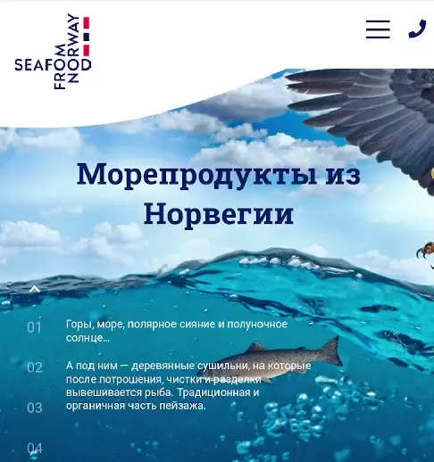

# SeaFood landing

### Use Skills

---

[Demo Link  ](https://golovanovalex.github.io/Seafood_landing/)

## Info

Создано на основе ролика с YouTube канала [От 0 до 1](https://www.youtube.com/c/%D0%9E%D1%820%D0%B4%D0%BE1)

Верстка полноценного сайта-лендинга. Работа с **HTML**, **CSS** и **JS**.  
Использование препроцессинга **SASS**, библиотеки **JQuery**, слайдера **Slick** и сборщика **Gulp**.  
Пройдена валидация HTML и CSS, а так же производительность с помощью **PageSpeed Insights**.

---

Респонсивный дизайн адаптирует сайт под любой экран устройства.

 &nbsp;&nbsp;&nbsp;&nbsp;&nbsp;&nbsp;&nbsp;

---

## Contacts

- <a href="mailto:golovanov.a.a@yandex.ru" >Golovanov.a.a@yandex.ru</a>
